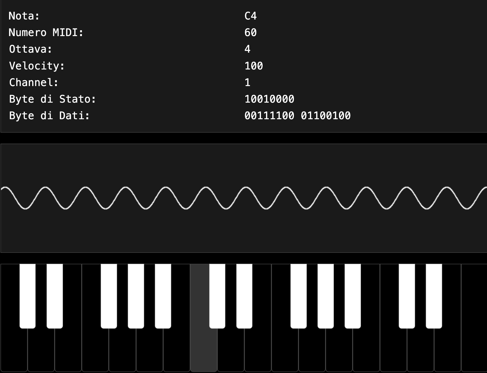

SUPSI 2025  
Corso d’interaction design, CV428.01  
Docenti: A. Gysin, G. Profeta  

Elaborato 2: Atlante tecnologico: file multimediali  

# Il protocollo MIDI
Autore: Cristian Sommaiuolo  
[Il protocollo MIDI](https://xiansom.github.io/protocolloMIDI/)


## Introduzione e tema
Nonostante il vasto utilizzo odierno, il protocollo MIDI è un'invenzione che risale agli anni '80 ed è per questo ho scelto di utilizzare uno stile grafico che richiamasse lo stile delle tecnologie di quel periodo storico. 
Il sito vuole essere una breve descrizione di cos'è, a cosa serve e come funziona il protocollo MIDI, e poichè questa tecnologia è utilizzato in campo musicale, ho scelto di inserire nella pagina degli elementi interattivi che permettano di riprodurre dei suoni come se fossero degli strumenti musicali, anche se molto semplificati.
Grazie a questa tecnologia infatti, è stato possibile mettere in comunicazione tra loro più strumenti musicali digitali e gestirli tutti contemporaneamente. 
Questo ha portato ad un nuovo modo di interagire con le tecnologie digitali che possono essere utilizzate come dei veri e propri strumenti musicali e a far si che molte più persone possano creare musica in maniera più versatile.   


## Riferimenti progettuali

Webgrafia: 

[Thomann](https://www.thomann.de/it/onlineexpert_page_tastiere_il_midi.html)

[Muzines](https://www.muzines.co.uk/articles/talking-midi/1274)

[Audiosonica](https://www.audiosonica.com/it/corsoaudio-online/principio-di-funzionamento-il-protocollo-midi)

[Wikipedia](https://it.wikipedia.org/wiki/Musical_Instrument_Digital_Interface)

[Suonoelettronico](https://www.suonoelettronico.com/interfacciamidi.html)


## Design dell’interfaccia e modalità di interazione
Per la realizzazione delle interazioni mi sono concentrato su tre elementi principali: un riproduttore audio, una serie di pulsanti per ripodurre brevi suoni percussivi appartenenti allo standard MIDI, ed una tastiera musicale interattiva il cui suono è generato da degli oscillatori sinusoidali.


Per il primo ho creato e inserito un pulsante per avviare la riproduzione di un file precaricato proprio nella parte iniziale della pagine. 
Il brano riprodotto prima di andare in uscita passa attraverso un filtro passa basso la cui frequenza di taglio è regolata dalla posizione dello scroll della pagina.
Con questa modalità di interazione si avrà una apertura del suono man mano che la pagina viene letta e quindi scrollata verso il basso. 
A questo elemento è stato aggunto anche un piccolo display che permette di visualizzare la traccia audio seguendo il metodo delle figure di Lissajous.
Questo viene visualizzato sul lato destro della pagina e rimane in posizione fissa quando si scrolla la pagina verso il basso in modo da poterlo vede durante la consultazione del sito. 

[]()


Per il secondo elemento ho ricreato un set di 28 campioni audio relativi alle percussioni utilizzate nel protocollo MIDI e li ho mappati con dei pulsanti interattivi che riprducono il singolo file di ogni specifico strumento percussivo. I pulsanti indicano il nome dello strumento e il relativo numero nella codifica MIDI.

[]()


Per il terzo elemento ho ricreato 3 ottave della tastiera di un pianoforte il cui suono generato ha una forma d'onda sinusoidale. 
I singoli tasti possono essere cliccati con il mouse ed è possibile gestirne la velocity (l'intensità) in base all'altezza della posizione del punto in cui viene cliccato il tasto. 
La tastiera è anch'essa collegata ad un display che permette di visualizzare la forma d'onda della frequenza che si sta ascoltando o delle eventuali note sovrapposte se, invece di usare il mouse si vuole interagire usando la tastiera alfanumerica del compouter. Questa infatti è stata mapppata per poter suonare anche più tasti contemporaneamente e suonare come se si stesse suonadno un vero sintetizzatore.
Il punto forte dell'elemento tastiera interattiva è un display che permette di visualizzare in tempo reale le informazioni MIDI della nota che si sta suonando. 

Un'ulteriore tipo di interazione è data dalla possibilità di ascoltare in sottofondo la traccia audio e poter suonare contermporaneamente la tastiera interattiva proprio come se fosse uno strumento musicale con cui creare musica sovrapponendo più sorgenti sonore. 

[]()


## Tecnologia usata
Per la creazione del sito ho utilizzato diverse AI, in particolare DeepSeek e poi Copilt all'interno di Visual Code. 
Questo mi ha permesso soprattutto di scrivere la parte di codice relativa agli elementi interattivi. 


```JavaScript
        <!-- TASTIERA MUSICALE INTERATTIVA-->
...
const notes = ['C', 'C#', 'D', 'D#', 'E', 'F', 'F#', 'G', 'G#', 'A', 'A#', 'B'];
            const startOctave = 3;
            const endOctave = 5; 
            let whiteKeys = [];
            let whiteKeyCount = 0;
            
            for (let octave = startOctave; octave <= endOctave; octave++) {
            for (let i = 0; i < 12; i++) {
                if (octave === 5 && ['F#', 'G', 'G#', 'A', 'A#', 'B'].includes(notes[i])) continue; 
                if (['C#', 'D#', 'F#', 'G#', 'A#'].includes(notes[i])) continue;
                
                const noteName = notes[i];
                const midiNumber = 12 * (octave + 1) + i;
                const frequency = 440 * Math.pow(2, (midiNumber - 69) / 12);
                
                const whiteKey = document.createElement('div');
                whiteKey.className = 'white-key';
                whiteKey.textContent = noteName + octave;
                whiteKey.dataset.note = noteName;
                whiteKey.dataset.octave = octave;
                whiteKey.dataset.midi = midiNumber;
                whiteKey.dataset.frequency = frequency.toFixed(2);
                whiteKey.dataset.position = whiteKeyCount;
                
                whiteKey.addEventListener('mousedown', function(e) {
                const rect = this.getBoundingClientRect();
                const clickY = e.clientY - rect.top;
                const height = rect.height;
                const velocity = Math.round(127 * (1 - clickY / height));
                playNote(this, velocity);
                });
                
                whiteKey.addEventListener('mouseup', () => stopNote(whiteKey));
                whiteKey.addEventListener('mouseleave', () => stopNote(whiteKey));
                
                keyboard.appendChild(whiteKey);
                whiteKeys.push({ 
                note: noteName, 
                octave: octave, 
                element: whiteKey,
                position: whiteKeyCount
                });
                
                whiteKeyCount++;
            }
            }
...

```

## Target e contesto d’uso
Il contenuto di questa pagine è per quelle persone che sono curiose, che hanno un minimo di conoscenze sulle tecnologie digitali, ma che non hanno competenze tecniche specifiche sull'argomento. Il funzionamento del protocollo MIDI è qualcosa di abbastanza complesso dal punto di vista tecnico. Lo scopo del sito non è in effetti quello di dare una spiegazione esaustiva ma, piuttosto, quello di dare una descrizione più generale senza entrare troppo nei dettagli, cosicché anche chi non ha dimestichezza con le tecnologie informatiche possa avere un quadro generale di cos'è e di come funziona il protocollo MIDI. 


